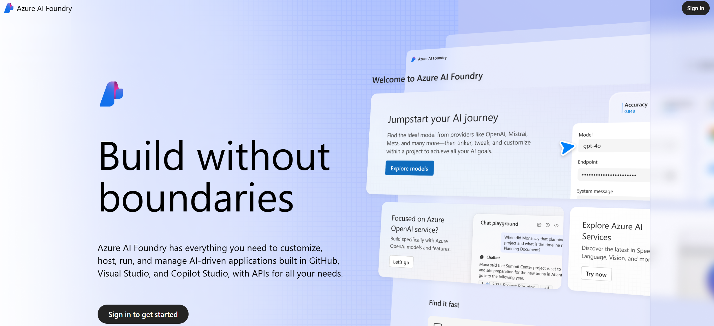
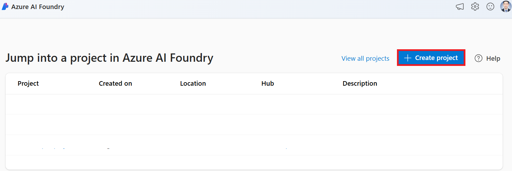
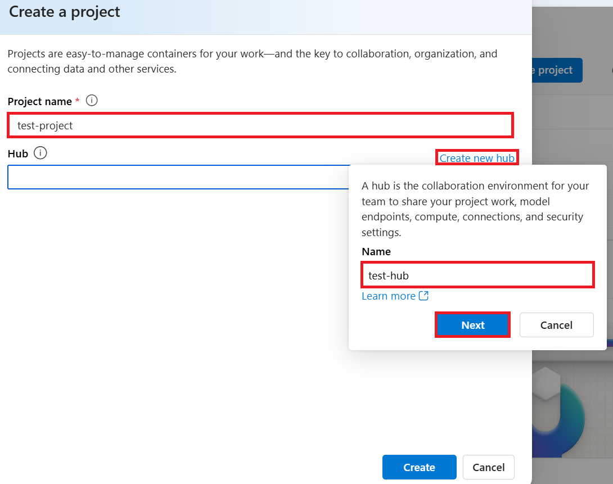
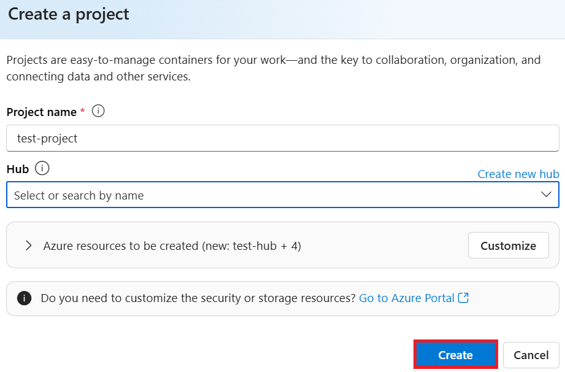
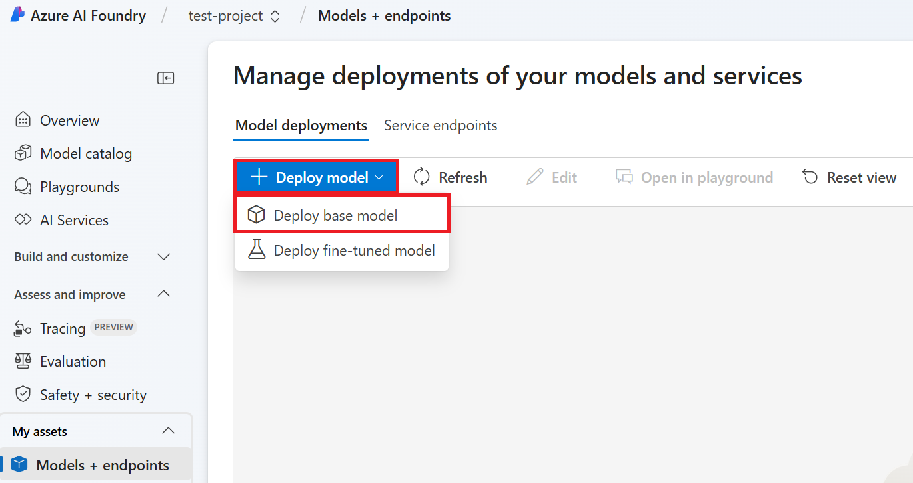
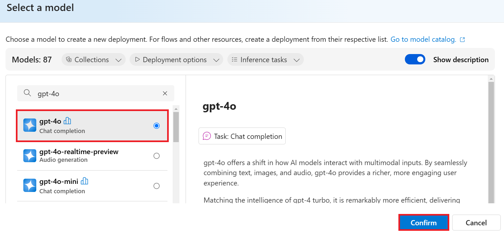
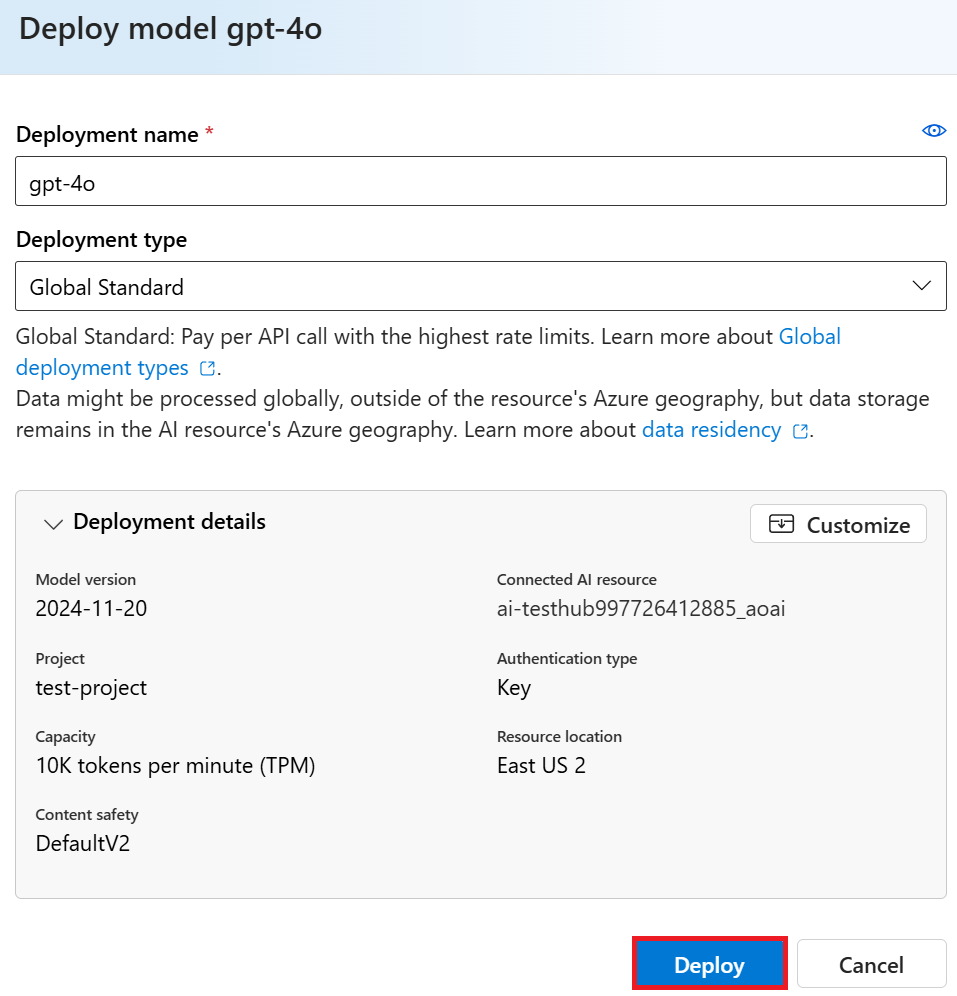

# Building a Basic Chatbot with Azure OpenAI

In this turorial, we'll build a simple chatbot that uses Azure OpenAI to generate responses to user queries.

## Overview

To create a basic chatbot, we need to set up a language model resource that enables conversation capabilities. In this tutorial, we will:

1. Set up the Azure OpenAI resource using the Azure AI Foundry portal.
1. Retrieve the API key needed to connect the resource to your chatbot application.

Once the API key is configured in your code, you will be able to integrate the language model into your chatbot and enable it to generate responses.

By the end of this tutorial, you'll have a working chatbot that can generate responses using the Azure OpenAI model.

## Table of Contents

1. [Signing In and Setting Up Your Azure AI Foundry Workspace](#signing-in-and-setting-up-your-azure-ai-foundry-workspace)
1. [Setting Up the Azure OpenAI Resource in Azure AI Foundry](#setting-up-the-azure-openai-resource-in-azure-ai-foundry)
1. [Retrieving the API Key from Azure AI Foundry](#retrieving-the-api-key-from-azure-ai-foundry)

## Signing In and Setting Up Your Azure AI Foundry Workspace

### Signing In to Azure AI Foundry

1. Open the [Azure AI Foundry](https://ai.azure.com/?wt.mc_id=studentamb_279723) page in your web browser.

1. Login to your Azure account. If you don't have an account, you can sign up.

    

### Setting Up Your Azure AI Foundry Workspace

1. Select **+ Create project** to create a new project.

    

1. Perform the following tasks:

    - Enter **Project name**. It must be a unique value.
    - Select **Hub** you'd like to use (create a new one if needed).

    

1. Select **Create**.

    

## Setting Up the Azure OpenAI Resource in Azure AI Foundry

In this step, you'll learn how to set up the Azure OpenAI resource in Azure AI Foundry. Azure OpenAI is a pre-trained language model that can generate responses to user queries. We'll be using it in our chatbot.

1. Select **Models + endpoints** from the left side menu.

    

1. On this page, you can deploy language models and set up Azure AI resources. In this step, we will deploy the Azure OpenAI GPT-4 language model. Select **+ Deploy model**.

1. Select **Deploy base model**.

    

1. In this tutorial, we will deploy the GPT-4o model. Select **GPT-4o**.

1. Select **Confirm**.

    

1. Select **Deploy**.

    

## Retrieving the API Key from Azure AI Foundry

