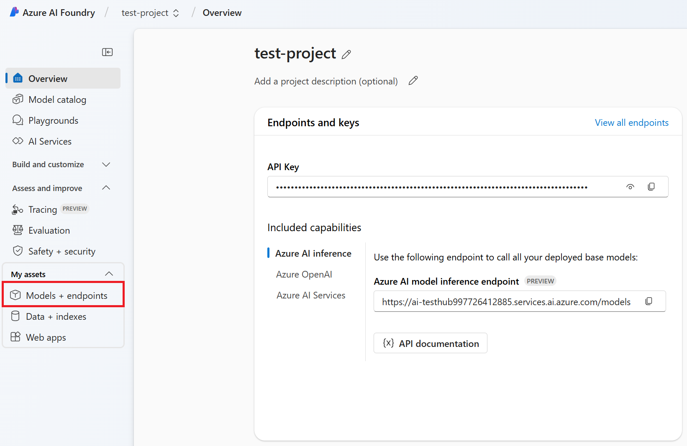

# Building a Basic Chatbot with Azure OpenAI

In this turorial, we'll build a simple chatbot that uses Azure OpenAI to generate responses to user queries.

## Overview

To create a basic chatbot, we need to set up a language model resource that enables conversation capabilities. In this tutorial, we will:

1. Set up the Azure OpenAI resource using the Azure AI Foundry portal.
1. Retrieve the API key needed to connect the resource to your chatbot application.

Once the API key is configured in your code, you will be able to integrate the language model into your chatbot and enable it to generate responses.

By the end of this tutorial, you'll have a working chatbot that can generate responses using the Azure OpenAI model.

## Signing In and Setting Up Your Azure AI Foundry Workspace

### Signing In to Azure AI Foundry

1. Open the [Azure AI Foundry](https://ai.azure.com/?wt.mc_id=studentamb_279723) page in your web browser.

1. Login to your Azure account. If you don't have an account, you can sign up.

    

### Setting Up Your Azure AI Foundry Workspace

1. Select **+ Create project** to create a new project.

    

1. Perform the following tasks:

    - Enter **Project name**. It must be a unique value.
    - Select **Hub** you'd like to use (create a new one if needed).

    

1. Select **Create**.

    

## Setting Up the Azure OpenAI Resource in Azure AI Foundry

In this step, you'll learn how to set up the Azure OpenAI resource in Azure AI Foundry. Azure OpenAI is a pre-trained language model that can generate responses to user queries. We'll be using it in our chatbot.

1. Select **Models + endpoints** from the left side menu.

    

1. On this page, you can deploy language models and set up Azure AI resources. In this step, we will deploy the Azure OpenAI GPT-4 language model. Select **+ Deploy model**.

1. Select **Deploy base model**.

    

1. In this tutorial, we will deploy the GPT-4o model. Select **GPT-4o**.

1. Select **Confirm**.

    

1. Select **Deploy**.

    

1. The model will be deployed. Once the deployment is complete, you will see the model listed on the **Models + endpoints** page.

    

1. Now that the model is deployed, you can retrieve the API key needed to connect the model to your chatbot application. Select the model you deployed on the **Models + endpoints** page.
`
    

1. On the model details page, you can view information about the model, including the API key. We will come back this page later to add the required information into the environment variables.

## Setting Up the Project and Install the Libraries

Now, you will create a folder to work in and set up a virtual environment to develop a program.

### Creating a Folder to Work Inside It

1. Open a terminal window and type the following command to create a folder named *basic-chatbot* in the default path.

    ```console
    mkdir basic-chatbot
    ```

2. Type the following command inside your terminal to navigate to the *basic-chatbot* folder you created.

    ```console
    cd basic-chatbot
    ```

### Creating a Virtual Environment

1. Type the following command inside your terminal to create a virtual environment named *.venv*.

    ```console
    python -m venv .venv
    ```

2. Type the following command inside your terminal to activate the virtual environment.

    ```console
    .venv\Scripts\activate.bat
    ```

> [!NOTE]
> If it worked, you should see *(.venv)* before the command prompt.

### Installing the Required Packages

1. Type the following commands inside your terminal to install the required packages.

   - **openai**: A Python library that provides integration with the Azure OpenAI API.  
   - **python-dotenv**: A Python library for managing environment variables stored in an *.env* file.

    ```console
    pip install openai python-dotenv
    ```

## Setting up the Project in Visual Studio Code

To create a basic chatbot program, you will need two files:

1. **`example.py`**: This file will contain the code to interact with Azure resources.
1. **`.env`**: This file will store the Azure credentials and configuration details.

> [!NOTE]
>
> ### Purpose of the `.env` File
>
> The `.env` file is essential for storing the Azure information required to connect and use the resources you created.
> By keeping the Azure credentials in the `.env` file, you can ensure a secure and organized way to manage sensitive information.

### Setting Up *example.py* File

1. Open **Visual Studio Code**.

1. Select **File** from the menu bar.

1. Select **Open Folder**.

    

1. Select the *basic-chatbot* folder that you created, which is located at *C:\Users\yourUserName\basic-chatbot*.

1. In the left pane of Visual Studio Code, right-click and select **New File** to create a new file named *example.py*.

    

1. Add the following code to the *example.py* file to import the required libraries.

    ```python
    from openai import AzureOpenAI
    from dotenv import load_dotenv
    import os
    
    # Load environment variables from the .env file
    load_dotenv()
    
    # Retrieve environment variables
    AZURE_OPENAI_ENDPOINT = os.getenv("AZURE_OPENAI_ENDPOINT")
    AZURE_OPENAI_API_KEY = os.getenv("AZURE_OPENAI_API_KEY")
    AZURE_OPENAI_MODEL_NAME = os.getenv("AZURE_OPENAI_MODEL_NAME")
    AZURE_OPENAI_CHAT_DEPLOYMENT_NAME = os.getenv("AZURE_OPENAI_CHAT_DEPLOYMENT_NAME")
    AZURE_OPENAI_API_VERSION = os.getenv("AZURE_OPENAI_API_VERSION")
    
    # Initialize Azure OpenAI client
    client = AzureOpenAI(
        api_key=AZURE_OPENAI_API_KEY,
        api_version=AZURE_OPENAI_API_VERSION,
        base_url=f"{AZURE_OPENAI_ENDPOINT}/openai/deployments/{AZURE_OPENAI_CHAT_DEPLOYMENT_NAME}"
    )
    
    print("Chatbot: Hello! How can I assist you today? Type 'exit' to end the conversation.")
    while True:
        user_input = input("You: ")
        if user_input.lower() == "exit":
            print("Chatbot: Ending the conversation. Have a great day!")
            break
        response = client.chat.completions.create(
            model=AZURE_OPENAI_MODEL_NAME,
            messages=[
                {"role": "system", "content": "You are a helpful assistant."},
                {"role": "user", "content": user_input}
            ],
            max_tokens=200
        )
        print("Chatbot:", response.choices[0].message.content.strip())
    ```

### Setting Up *.env* File

To set up your development environment, we will create a `.env` file and store the necessary credentials directly.

> [!NOTE]
> Complete folder structure:
>
> ```text
> └── YourUserName
> .    └── basic-chatbot
> .        ├── example.py
> .        └── .env
> ```

1. In the left pane of Visual Studio Code, right-click and select **New File** to create a new file named *.env*.

1. Add the following code to the *.env* file to include your Azure information.

    ```plaintext
    AZURE_OPENAI_API_KEY="your_azure_openai_api_key"
    AZURE_OPENAI_ENDPOINT="https://your_azure_openai_endpoint"
    AZURE_OPENAI_MODEL_NAME="your_model_name"
    AZURE_OPENAI_CHAT_DEPLOYMENT_NAME="your_deployment_name"
    AZURE_OPENAI_API_VERSION="your_api_version"
    ```

### Retrieving Environment Variables from Azure AI Foundry

Now, you will retrieve the required information from Azure AI Foundry and update the `.env` file.

1. Go to the **Models + endpoints** page and select your deployed model.  
    

1. On the **Model Details** page, copy the following information in to the `.env` file.:  
    - **AZURE_OPENAI_API_KEY**  
    - **AZURE_OPENAI_ENDPOINT**  
    - **AZURE_OPENAI_MODEL_NAME**  
    - **AZURE_OPENAI_CHAT_DEPLOYMENT_NAME**  
    

1. Paste this information into the `.env` file in the respective placeholders.

